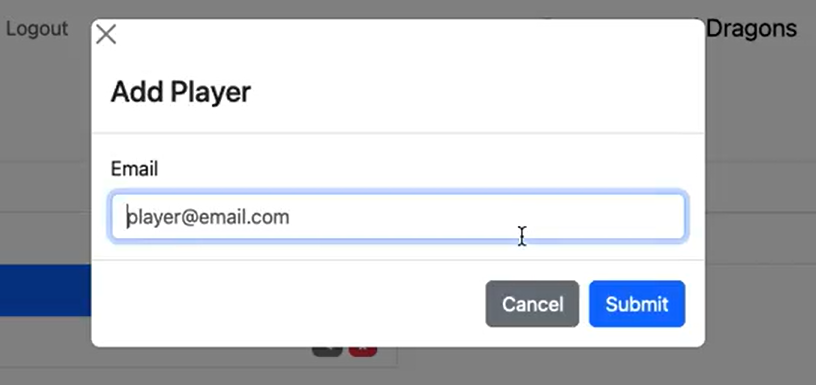

# Nodwick Release Notes

This is the beta release of the Nodwick app for tabletop RPG inventory management. Please report any errors or unexpected behavior to <deejmwilliams@gmail.com>.

### Overview

This app allows you to track character inventories when playing a tabletop roleplaying game like Dungeons & Dragons. All data is stored securely on a remotely hosted Google Firestore database. You can create games, characters and locations which are stored inside games, and items which can be moved between characters and locations.

## New Features

### Logging In

The “Log in” button on the landing page will take you to an external authentication page. User email/password data is handled by [Auth0](https://auth0.com/) and not stored publicly. You may have to confirm your email address when signing up.

### Creating and Accessing Games

Using the “New Game” button from the homepage will open a form for creating a new game. All you need to start is a title, like “Bob’s Castles and Crusaders Game” or “Pathfinder 2e.” To navigate to any game, just select it from the list and click “Enter” in the preview.

### Characters and Locations

Creating characters and locations is simple: just click on the button next to the section header to bring up a form for creating a new one. All characters and locations need is a name.

You can edit the names of characters and locations by clicking the gray edit button or remove them by clicking the red delete button. Deleting a character or location that has items will move all of those items into the default location “Unassigned,” which can’t be removed. Clicking on the name of a character or location will display all items held by that character or in that location on the right side of the page.

### Items

When you click the “New item” button while viewing the inventory of a character or location, you can create an item in that location or character inventory. Items also need a “type” (such as “weapon,” “potion,” or “clothing”). Right now, types aren’t interpreted in any way by the app, but keep an eye out for later releases that will allow you to sort and filter items by category.

Clicking on an item will pull up a preview that shows its name, type, and location. The “Edit” button will allow you to move, rename, delete, or change the type of an item.

*Preview of the "Wand of Freezing"*

*Edit menu for the "Wand of Freezing"*

You can also move an item by dragging and dropping it onto another character or location.

### Game Options: Renaming, Deleting, Adding Players

Currently, any player can delete or rename a game they’re in from the game options menu. Use this power wisely.

The beta version of the “Add Player” feature is pretty primitive: you add a user via their email. They get automatically granted access to the game if they have an account. If they don’t, when they create an account with that email address, they’ll have access to the game.

## Upcoming Features

Be on the lookout for announcements about timing of the next release. Features we plan to add include:
+ A dark mode theme to make the app easier on the eyes
+ Ability to sort and filter items
+ An email confirmation step when adding a player to a game
+ Some default categories for item types
+ Support for adding more optional attributes to objects, like weight and value
